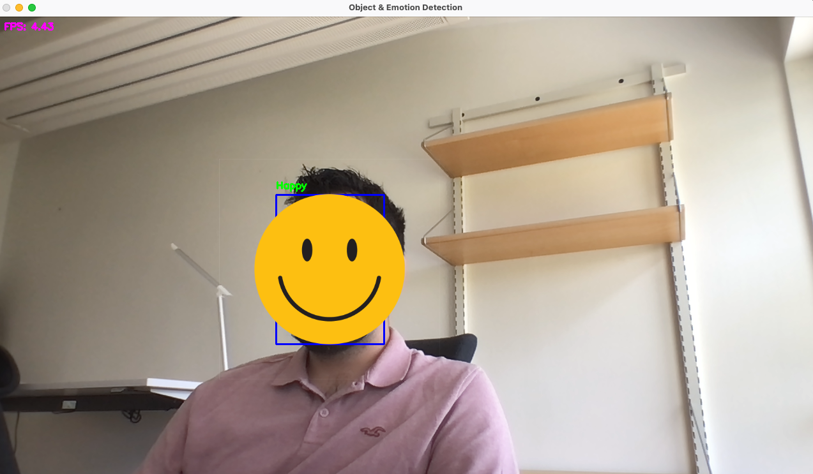

# Real-Time Object & Emotion Detection + Training Pipeline  

This repository combines two key components in one project:  
1. **Training a MobileNetV2 model** on [FER-2013](https://www.kaggle.com/datasets/msambare/fer2013) for facial emotion recognition.  
2. **Real-time inference** using YOLOv8 for object detection and the trained MobileNetV2 for emotion classification via webcam.  

---

##  Features  
- **YOLOv8 Object Detection** → Detects people/objects in real-time.  
- **Emotion Recognition** → MobileNetV2 classifies faces into 7 emotions:  
  - Angry, Disgust, Fear, Happy, Neutral, Sad, Surprise  
- **Training Pipeline**:  
  - Data augmentation (grayscale, rotations, affine transforms, resize).  
  - Class balancing with `WeightedRandomSampler`.  
  - Early stopping & learning rate scheduling.  
  - Training/Validation/Test splits.  
  - Experiment tracking with **Weights & Biases (wandb)**.  

---

##  Project Structure  
```
.
├── ER_pipeline_imagenet.py         # Real-time Object & Emotion Detection
├── MobileNet_emotion_pretrained.py        # Training MobileNetV2 on FER-2013
├── README.md        # Documentation
└── Models/
    ├── Yolo_Weights/         # YOLOv8 weights
    │   └── yolov8m_200e.pt
    └── Mobilenet/            # Trained MobileNetV2 models
        ├── MobileNetV2_best_model.pth
        └── MobileNetV2_last_model.pth
```

---

##  Installation  

1. **Clone repo**  
```bash
git clone https://github.com/your-username/object-emotion-detection.git
cd object-emotion-detection
```

##  Dependencies  
The main dependencies used in both training and inference are:  
```
torch
torchvision
opencv-python
ultralytics
Pillow
numpy
wandb
torchsummary
```

---

##  Usage  

###  1. Train Emotion Recognition Model (FER-2013)  
1. Download [FER-2013 dataset](https://www.kaggle.com/datasets/msambare/fer2013).  
2. Organize the dataset as:  
   ```
   FER-2013/
   ├── train/
   │   ├── angry/
   │   ├── happy/
   │   └── ...
   └── test/
       ├── angry/
       ├── happy/
       └── ...
   ```
3. Run training:

This will:  
- Train MobileNetV2 on FER-2013.  
- Save **best** and **last** weights in `models/Mobilenet/`.  
- Log metrics to **Weights & Biases**.  

---

###  2. Real-Time Object + Emotion Detection  
1. Place trained MobileNetV2 weights inside `models/Mobilenet/`.  
2. Place YOLOv8 weights (`yolov8m_100e.pt`) inside `models/Yolo_Weights/`.  
3. Run inference
4. A webcam window opens showing:  
   - Detected objects with bounding boxes.  
   - Predicted **emotion labels** above detected faces.  
   - FPS counter.  
5. Press **Q** to quit.  

---

##  Example Outputs  
- **Training Logs** (via W&B)  
- **Real-time webcam feed** with bounding boxes + emotion labels  


---

##  Notes  
- Training uses **grayscale images** (1-channel), but inference expands them to 3 channels to match ImageNet normalization.  
- The **WeightedRandomSampler** ensures balanced training across emotion classes.  
- Early stopping prevents overfitting.  
- If GPU is available (`torch.cuda.is_available()`), both training and inference will run on CUDA automatically.  

---

